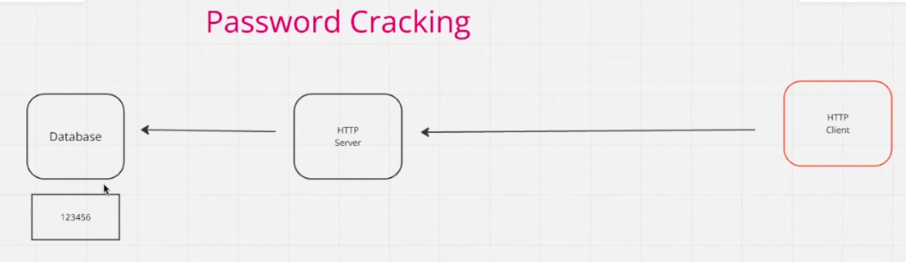
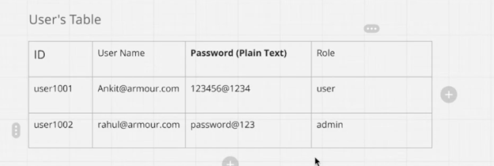
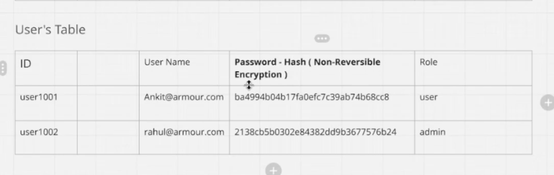
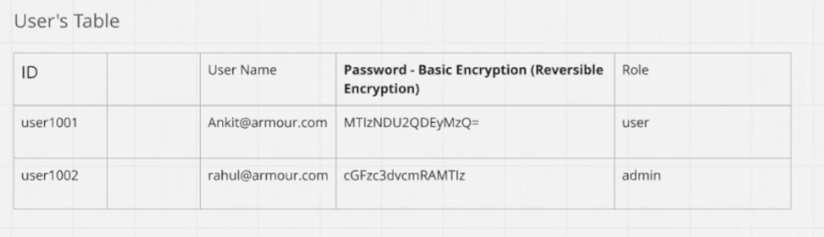
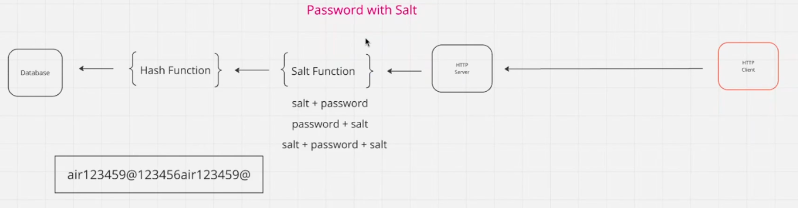

# Password-Cracking 🛡️

## Password Cracking
A **password (PIN / passcode / secret)** 🤫 is a secret used for **authentication** ✅. This guide explains how passwords are stored, the differences between hashing and encryption, common cracking techniques and useful commands and tools. 🛠️

---

## Terminology
* **Plain text:** the password as entered by a user (e.g. `@rmour123`). 🔑
* **Hash (non-reversible):** deterministic **one-way transformation** ➡️ of input used for storage (MD5, SHA1, SHA256, etc.). 🧱
* **Encryption (reversible):** **encoding** that can be reversed with a **key**. 🔄
* **Salt:** additional random data 🧂 combined with a password to prevent lookup/rainbow-table attacks. 🌈

---

## Hashing vs. Encryption
* **Hashing:** **one-way (non-reversible)**. Used to validate passwords without storing plaintext.
    * Weak algorithms (**MD5, SHA-1**) are easily cracked 💥 — **avoid them for new systems**. 
* **Encryption:** **reversible** if you have the key. Use when you need to recover plaintext (rare for user passwords). 

---

## Examples
* **Plain:** `@rmour123`
* **Base64 (reversible):** `QHJub3VyMTIz` (Base64 of `@rmour123`)
* **ROT13 (simple character substitution (see:** https://cryptii.com/pipes/rot13-decoder)

---

## Common Hash Types (examples)
Here’s the text content from the image rewritten in clean **Markdown format**:

---

## MD5

**MD5 (Message-Digest Algorithm 5)** is a widely used cryptographic hash function that produces a fixed 128-bit (16-byte) hash value from an input message of any length. It was designed by Ronald Rivest in 1991 to replace MD4 and is specified in RFC 1321. MD5 works by processing the input data in 512-bit blocks through a series of operations including bitwise functions (AND, OR, XOR, NOT), modular addition, and left rotations, resulting in a unique 128-bit message digest (hash).

MD5 hashes are typically represented as 32 hexadecimal characters. Even a small change in the input results in a significantly different hash due to the avalanche effect. While MD5 was widely used for purposes like verifying data integrity and digital signatures, it has known security vulnerabilities (collisions) that make it unsuitable for secure cryptographic applications today. However, it remains useful for non-cryptographic purposes like checksums and data partitioning because of its low computational requirements.

---

### Key Points

* **MD5 outputs a 128-bit fixed-length hash.**
* **Input message is padded and divided into 512-bit blocks.**
* **Uses four rounds of 16 operations involving four logical functions.**
* **Commonly represented as 32 hex digits.**
* **Vulnerable to collision attacks, hence not recommended for cryptographic security.**
* **Still used for checksums and data integrity verification.**

---

### Example

* **MD5** — example: `974f11862f34299a8d18d93ada3daea` for `@rmour123` (**Note: MD5 is not secure**). 
```bash
echo -n test123 | md5sum
```


* **SHA-1** — example: `f37b2c0f0eb516dc5c5d52f3d2391221b6c0b2e3` for `@rmour123`.
```bash
echo -n @rmour123 | sha1sum
```
* **NTLM** — example: `E41B0D19A88d2c1c1fcfd3080ff2B097090` for `@rmour123`.


## Salting examples 🧂

## Password + Salt
* **Input:** `123456` + (`*23e9043e-02-36*2sp03e`) + (`*6LOP`) ➡️
* **Concatenation:** `123456(*23e9043e-02-36*2sp03e)(*6LOP` 🔗
* **Hash:** `91ff5ecbad04fb0f813b3561580106aac` ✅

## Salt + Password
* **Input:** (`*23e9043e-02-36*2sp03e`) + (`*6LOP`) + `123456` ➡️
* **Concatenation:** `(*23e9043e-02-36*2sp03e)(*6LOP123456` 🔗
* **Hash:** `93626223266b3dc5170a18830dac52ba` ✅

## Salt + Password + Salt
* **Example:** (`*23e9043e-02-36*2sp03e`) + (`*6LOP123456` + (`*23e9043e-02-36*2sp03e`) + (`*6LOP` 🔄
* **Hash:** `c61b9b9a7a27236defcf2764ff891a139` ✅

---

## Composed hashes 🛠️
* **MD5(MD5(password))** — example: `19cfe2620f714a9b82f4d544d1fab9d2` for `@rnour123` 💡
* **SHA512(MD5(password))** — example: very long SHA512 digest of the MD5 result. 📏

> [ **Note:** Custom or composed schemes can give a **false sense of security** — use well-reviewed **slow hashes** (**bcrypt**, **scrypt**, or **Argon2**) for password storage. ]

---

## Example: User Tables (Plaintext, Reversible, and Hash)

### User's Table - Plain Text ❌

| ID | User Name | Password (Plain Text) | Role |
| :--- | :--- | :--- | :--- |
| user1001 | ankits@armour.com | 123456@1234 | user |
| user1002 | rahul@armour.com | password@123 | admin |

### User's Table - Basic Encryption (Reversible) - Base64 ⚠️

| ID | User Name | Password - Basic Encryption (Reversible) | Role |
| :--- | :--- | :--- | :--- |
| user1001 | ankits@armour.com | MTIZNDU2MDEyMzQ= | user |
| user1002 | rahul@armour.com | cGFzc3dvcmQxMjM= | admin |

> [ **Note:** Base64 is reversible — anyone with the string can decode it back to the original password. **Do not use Base64 to store secrets.** ]

### User's Table - Hash (Non-Reversible) ✅

| ID | User Name | Password - Hash (Non-Reversible) | Role |
| :--- | :--- | :--- | :--- |
| user1001 | ankits@armour.com | ba6994b0ab3f7a0eefc7c394b7d468c8 | user |
| user1002 | rahul@armour.com | 2138c5b8b382e84382d9db1b7757b824 | admin |

> [ **Note:** These look like **MD5 hashes** (128-bit hex). MD5 is considered **insecure** for password storage. Prefer **bcrypt**, **scrypt**, or **Argon2** with a unique **per-password random salt** and an appropriate **work factor**. ]

---

## Recommended action 💡

* Migrate stored passwords to a **slow, salted hash** (e.g., Argon2id or bcrypt).
* Require a **password reset** on migration, or **re-hash** on next successful login after validating the old credential.
* **Never store reversible encodings (Base64) or plaintext in databases.**













---

# Hash identification

Useful to identify what type of hash you have before attempting cracking.

### Commands:

```bash
hashid 5f4dcc3b5aa765d61d8327deb882cf99
```
```bash
hashid -m 5f4dcc3b5aa765d61d8327deb882cf99
```
```bash
hash-identifier 5f4dcc3b5aa765d61d8327deb882cf99
```
---

