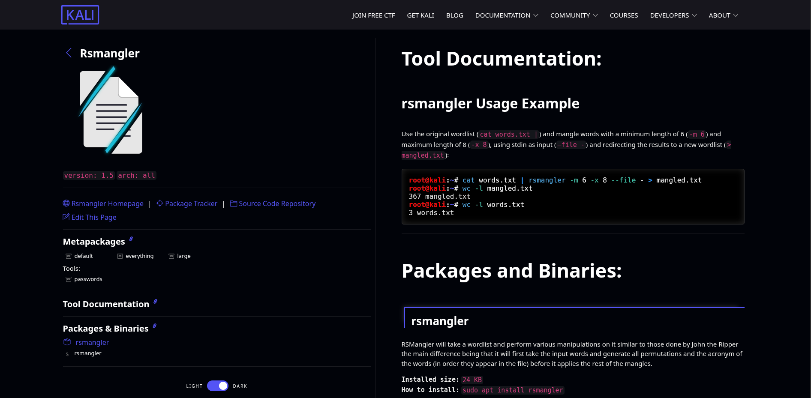
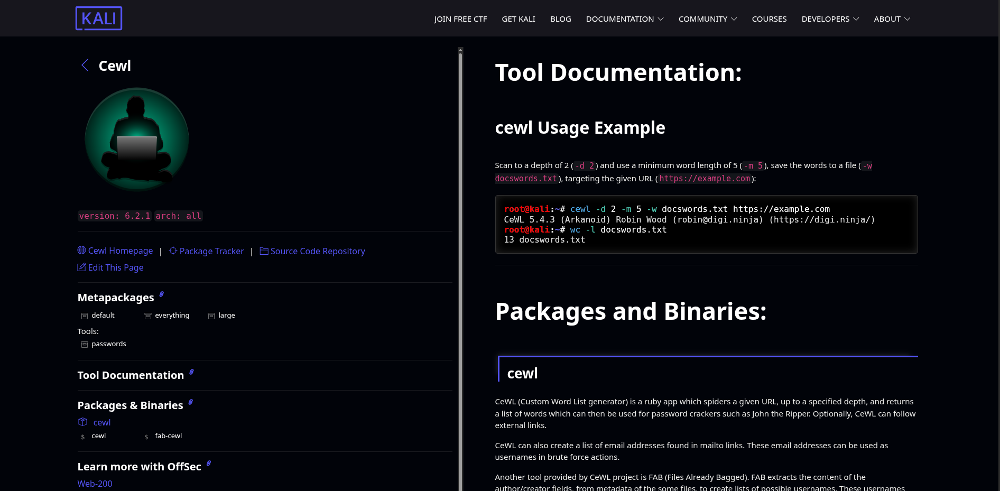

# 🧩 Creating Wordlists

A concise, practical reference for building wordlists commonly used in pentesting and password-recovery workflows.

---

# 📦 Prebuilt wordlists

### Common commands and tips for working with distributed / prepackaged wordlists:

* **View compressed contents without extracting**

```bash
zcat /usr/share/wordlists/rockyou.txt.gz
```

* **Copy compressed file to another location and extract**

```bash
cp -v /usr/share/wordlists/rockyou.txt.gz /opt/rockyou.txt.gz
```

* **Unpack rockyou (Debian/Ubuntu path)**

```bash
gunzip /opt/rockyou.txt.gz
```

* **View contents of the wordlist**

```bash
cat /opt/rockyou.txt
```

* **Search for a literal word in a list**

```bash
# exact match
grep "^ilove$" rockyou.txt
```
```bash
# starts with
grep "^ilove" rockyou.txt
```
```bash
# ends with
grep "ilove$" rockyou.txt
```

---

### Install additional collections

```bash
sudo apt update
```
```bash
sudo apt install seclists
```
```bash
cd /usr/share/seclists
```

### Useful public lists

* **rockyou.txt** — commonly available via Kali / wordlists packages
  Path: `/usr/share/wordlists/rockyou.txt.gz`
* **CrackStation wordlist** — `crackstation.txt.gz` (public download from CrackStation)

---

# 🔨 Crunch — Generate Custom Wordlists

Crunch is a flexible generator for brute-force / mask-based wordlists.

---

## 🆘 View help / manual

```bash
crunch --help
```
```bash
man crunch
```

## Syntax

```bash
crunch <min> <max> [charset] -t <pattern> -o <output-file>
```

### All combinations length 4 from default charset `[a-z]`

```bash
crunch 4 4
```

### Numeric combos length 4

```bash
crunch 4 4 0123456789
```

### Length 8 using default charset

```bash
crunch 8 8
```

### Lengths 8 through 12

```bash
crunch 8 12
```

---

## 🔣 Using `-t` pattern with placeholders

* `@` = lowercase
* `,` = UPPERCASE
* `%` = numbers
* `^` = symbols

Examples:

```bash
crunch 10 10 0123456789 -t 9%%%%%%%%%
```
```bash
crunch 10 10 0123456789 -t 98260%%%%%
```
```bash
crunch 13 13 0123456789 -t 98260%%%%%^^^
```


### Example targeted lists

```bash
crunch 8 8 -t air%%%%% -o airtel-wordlist.txt
```
```bash
crunch 8 8 -t pass@@%% -o pass-patterns.txt
```


### `-l` treats some placeholders as literal characters (must match `-t` length)

```bash
crunch 8 8 -t pass@@%% -l aaaa@aaa
```
```bash
crunch 8 8 -t pass@%%% -l aaaa^%aa
```


### Permutations and small lists

```bash
# permutations of listed words
crunch -p hacking password ethical
```
```bash
# permutations with set length
crunch 6 6 -p hacking
```

### Username pattern example: user + 4 digits

```bash
crunch 8 8 -t user%%%% -o user_4digits.txt
```

### Pattern example: Abc@123

```bash
crunch 7 7 -t ,@@^%%%
```

---

## Other useful options

* `-p` → generate permutations of given words (`crunch -p a b c`)
* `-o` → write to a file (`-b` to split output into smaller files)
* See `crunch --help` for more flags

---

# 🛠️ RSMangler — Password Mangling / Mutation Utility

RSMangler applies multiple mangling rules to a base wordlist producing large candidate sets. Small Ruby script commonly included in Kali.

**GitHub:** `https://github.com/digininja/RSMangler`

### Key features

* Case changes, leet substitutions, prefixes/suffixes (years, numbers), permutations, reversals, `ed/ing`, punctuation, and more.
* Generates many common password variants from simple base words.
* No external Ruby gems required.
* Great for penetration testing and ethical hacking (authorized testing only).

---

# ⚙️ RSMangler / Wordlist Mutator — Useful Options

|               Option | Description                                                          |
| -------------------: | -------------------------------------------------------------------- |
|  `--file, -f <file>` | Input wordlist file or `-` for stdin                                 |
|        `--perms, -p` | Permute/combine words (**very explosive; use only with tiny lists**) |
|       `--double, -d` | Repeat each word twice                                               |
|      `--reverse, -r` | Reverse the word                                                     |
|         `--leet, -t` | Apply common leetspeak substitutions                                 |
|    `--full-leet, -T` | Apply full leetspeak variants                                        |
|      `--capital, -c` | Capitalize words                                                     |
|        `--upper, -u` | Convert to uppercase                                                 |
|        `--lower, -l` | Convert to lowercase                                                 |
|         `--swap, -s` | Swap case (toggle upper/lower)                                       |
|           `--ed, -e` | Add `ed` suffix                                                      |
|          `--ing, -i` | Add `ing` suffix                                                     |
|      `--punctuation` | Add common punctuation suffixes                                      |
|      `--pna / --pnb` | Add `01–09` suffix/prefix                                            |
|        `--na / --nb` | Add `1–123` suffix/prefix                                            |
|            `--years` | Add years from **1990** to current year                              |
|          `--acronym` | Build acronyms from input words                                      |
|           `--common` | Add common words like `admin`, `sys`, `pwd`                          |
| `--allow-duplicates` | Disable duplicate filtering (**faster, less memory**)                |
|    `--output <file>` | Write output to a file                                               |

---

## ✅ Practical Examples

Create a base file:

```bash
vim base.txt
# add:
# armour
# infosec
# hacking
# ethical
```

Basic pipe with length limits to avoid massive output (keep generated passwords between 6 and 12 chars):

```bash
cat base.txt | rsmangler -m 6 -x 12 --file -
```
```bash
cat base.txt | rsmangler -m 6 -x 12 --file - > mangled.txt
```

Generate leet + years + numeric variants:

```bash
rsmangler --file base.txt --leet --years --na --pna --punctuation --output mangled.txt
```

Permutations on a very small list (⚠️ explosive output):

```bash
rsmangler --file base.txt --perms --acronym --years > permuted_mangled.txt
```

Pipe directly into Hydra (authorized testing only):

```bash
rsmangler --file target_usernames.txt --leet --na | hydra -l username -P - ssh://target.example.com
```

---

# 🧠 Common Leetspeak / Mutation Rules

* Common leetspeak substitutions:

```
a -> 4, e -> 3, i -> 1, o -> 0, s -> 5, t -> 7
```
```bash
rsmangler --file base.txt --full-leet
```
* `--full-leet` applies broader substitutions for larger output.
* Other mutations: suffixes (`1..123`, `01..09`), years (`1990..present`), `ed/ing`, punctuation, capitalization, doubling, reversing, acronyms, permutations.

---

# 🧾 Tips & Size Control

* Use `-m` (min length) and `-x` (max length) to control output size.
* Use `--allow-duplicates` to speed up generation when duplicates are acceptable.
* For targeted attacks, seed the wordlist with OSINT-derived words (e.g., company or employee names).
* CRC32-based duplicate checking allows memory-efficient streaming.
* Prefer smaller, targeted base wordlists with aggressive mangling for best results.

---

# 🔗 Integration with Other Tools

* Works with **Hydra**, **Medusa**, **ncrack** by piping output (`-P -` flag).
* Use with **John the Ripper** or **hashcat** by generating a mangled wordlist and passing it as input.
* Prefer smaller, targeted base wordlists with aggressive mangling for best results.

---

If you want, I can:

* ✅ Combine this into a single downloadable `WORDLISTS.md` ready for GitHub.
* 🧾 Add a short quick-reference cheat sheet (1-page) with the most common Crunch / RSMangler / CeWL commands.
* 🧰 Add example pipelines (CrackStation + RSMangler + Hydra) with warnings and best-practice notes.

Which of those would you like next? 🛠️


## 🔡 Common Leetspeak / Mutation Rules

* **Common leetspeak substitutions:**

  ```
  a -> 4, e -> 3, i -> 1, o -> 0, s -> 5, t -> 7
  ```

* `--full-leet` applies broader substitutions for larger output.

* Other mutations include suffixes (`1..123`, `01..09`), years (`1990 to present`), `ed/ing` endings, punctuation, capitalization, doubling, reversing, acronyms, and permutations.

---

## ⚙️ Tips and Size Control

* Use `-m` (min length) and `-x` (max length) to control output size.
* Use `--allow-duplicates` to speed up generation when duplicates are acceptable.
* For targeted attacks, seed the wordlist with OSINT-derived words *(e.g., company or employee names).*
* CRC32-based duplicate checking allows memory-efficient streaming.

---

# 🔗 Integration with Other Tools

* Works with **Hydra**, **Medusa**, and **ncrack** by piping output (`-P -` flag).
* Use with **John the Ripper** or **hashcat** by generating a mangled wordlist and passing it as input.
* Prefer smaller, targeted base wordlists with aggressive mangling for best results.

---

### 📚 References:

* [RSMangler GitHub](https://github.com)
* [Kali Linux Tool Page](https://www.kali.org/tools)
* [Hydra Integration Example](https://github.com)

---
# 🕸️ CeWL — Cheat Sheet (Custom Word List Generator / Web Crawler)

CeWL is a Ruby web-crawler that spiders a target URL (default depth **2**), extracts unique words found on the site (optionally emails and metadata), and outputs a custom wordlist. Useful for targeted password cracking and pentesting. It can follow external links if enabled and can extract author/creator metadata from documents.

**GitHub:** [https://github.com/digininja/CeWL](https://github.com/digininja/CeWL)


---

## 🔑 Key Options (Most Useful)

* `-d <x>`, `--depth <x>` — Spider depth (default **2**).
* `-m`, `--min_word_length` — Minimum word length (default **3**).
* `-o`, `--offsite` — Allow crawling other domains (**caution:** can explode crawl scope).
* `-w`, `--write <file>` — Write output to file instead of stdout.
* `-e`, `--email` — Include email addresses found (mailto links). Use `--email_file` to save emails.
* `-a`, `--meta` — Include metadata extraction from files (PDFs, Office). Use `--meta_file` to save metadata.
* `-u`, `--ua <agent>` — Set custom User-Agent header.
* `-H`, `--header` — Add arbitrary HTTP headers. Can be used multiple times.
* `--proxy_host/--proxy_port` — Proxy support, including credentials.
* `-c`, `--count` — Show count for each word (frequency).
* `-n`, `--no-words` — Do not output words (useful if only emails or metadata are needed).
* `-v`, `--verbose` / `--debug` — Enable verbose/debug output.

*(Full help: `./cewl.rb --help`)*

---

## 🧪 Practical Examples

### Basic crawl — depth 2 (default), output to stdout

```bash
cewl.rb https://target.example.com
```
```bash
cewl https://www.armourinfosec.com
```

### Write words to file, minimum word length 4, depth 1

```bash
cewl -d 1 -m 4 -w target_words.txt https://www.armourinfosec.com
```

### Extract emails and save separately

```bash
cewl --email --email_file emails.txt -w words.txt https://www.armourinfosec.com
```

### Include metadata extraction and save meta

```bash
cewl --meta --meta_file meta.txt -w words.txt https://www.armourinfosec.com
```

---

## 🧭 Crawl offsite domains, use custom User-Agent and proxy

```bash
cewl -o -u "Mozilla/5.0 (X11; Linux x86_64)" --proxy_host 127.0.0.1 --proxy_port 8080 -w words.txt https://www.armourinfosec.com
```

---

## 🔁 Integration Tips (Workflows)

* **Feed CeWL output into mangling tools or password crackers**:

```bash
cewl -w words.txt https://target | rsmangler --file words.txt ...
```

* **Pipe wordlist into hashcat** (example):

```bash
hashcat -a 0 -m <mode> hashfile words.txt
```

* Use `-c` in CeWL to find high-frequency words on the target to prioritize guesses (frequency-based ordering helps focused attacks).

* Extracted emails and metadata are handy to build username lists for subsequent tests.

---

## ⚠️ Practical Tips & Cautions

* Keep default depth (`2`) and **avoid** `--offsite` for safer, focused crawls — offsite can massively expand scope.
* Increase minimum word length (`-m`) to avoid clutter from short tokens.
* Metadata extraction requires `exiftool` (it can reveal authors/usernames; respect privacy).
* **CeWL does not honor `robots.txt`** — be polite: control crawl rate and scope.
* **Always obtain written authorization** before crawling or using harvested data (authorized/ethical testing only).

---

## ❓ Why CeWL Is Useful vs Generic Wordlists

* CeWL builds **context-specific** wordlists from target content (project names, people, documents, slogans, etc.).
* These tailored lists often yield **higher-quality candidates** and can improve password-cracking success rates compared to generic/global wordlists.

---

# 🧩 CUPP — Cheat Sheet (Common User Passwords Profiler)

CUPP is a Python-based, user-profile-driven wordlist generator. It interactively collects personal or OSINT data about a target (names, birthdays, pets, keywords, company info, etc.) and generates candidate password lists by combining, permuting, and applying common mangles (numbers, years, leet, case variants). This yields smaller, more targeted wordlists than generic dictionaries.

**GitHub:** [https://github.com/Mebus/cupp](https://github.com/Mebus/cupp)

---

## 🔑 Main Modes / Flags (Common)

* `-i` — **Interactive mode**: prompts user to input target details.
* `-o <file>` / `--output <file>` — Write generated wordlist to file.
* `-w <file>` — Write wordlist to file (flag names vary by CUPP fork/version).
* `-k <keywords>` — Use comma-separated keywords to seed wordlist (non-interactive).
* `--leet` — Enable leetspeak variations (version dependent).
* `-h` / `--help` — Display help / usage for installed version.

> **Note:** CUPP has several forks with slightly different flags. Check your local version with:

---

## 📝 Install (package)

```bash
sudo apt install cupp
```
---

## ▶️ Interactive session

```bash
cupp -i
```

Prompts for names, pets, birthdays, company info, etc. → outputs a combined wordlist.

---

## ✅ Practical Tips & Best Practices

* 🔎 **Use OSINT to seed CUPP** with relevant target info (LinkedIn, GitHub, social media, resumes).
* 🎯 **Keep lists small and focused** — targeted lists outperform massive generic dictionaries.
* 🔁 **Pipe CUPP output to manglers** (e.g., RSMangler) for leet, years, punctuation variants.
* ⚠️ **Be mindful of fork differences** — CUPP has several forks with slightly different flags/features; check docs for your version.
* 🤖 **Automate cautiously** — ensure legal and ethical boundaries are maintained at all times.

---
