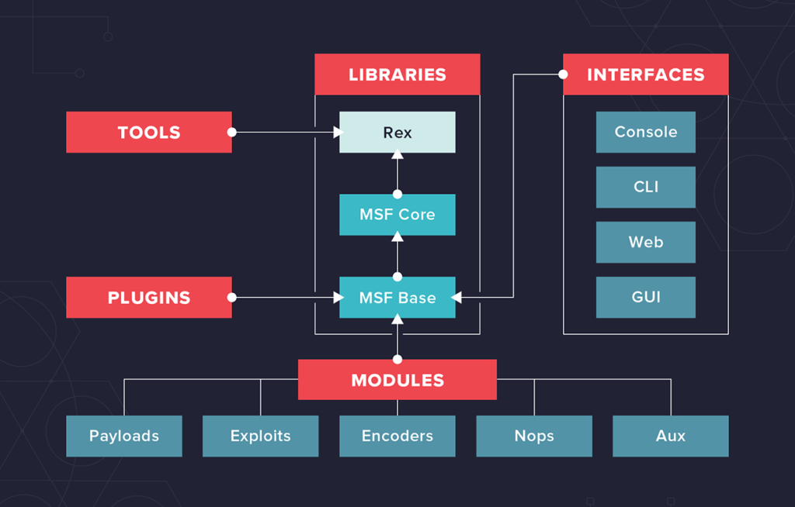

# 🔥 **Metasploit** 🔥
 

### Metasploit is a powerful computer security project and framework widely used for **penetration testing**, **vulnerability assessment**, and **exploit development**.

### It is an **open-source tool** owned by Rapid7 that provides a vast collection of exploits, payloads, and auxiliary modules, helping security professionals test and analyze system weaknesses.  

### Metasploit simulates attacks to identify vulnerabilities, strengthen defenses, and demonstrate the potential risks attackers could exploit. 🛡️💻

---

## 🚀 **Key Features of Metasploit**
- 🧰 Contains thousands of ready-made exploits and payloads for platforms including **Windows, Linux, macOS, Android**, and more.  
- 🧩 Modular architecture allows mixing **exploits, payloads, encoders, and auxiliary tools** to create custom attacks.  
- 🔍 Includes tools for **vulnerability scanning**, exploitation, and post-exploitation like **Meterpreter** sessions.  
- 🌐 Integrates with scanners such as **Nmap** and vulnerability management tools.  
- 💼 Available as **open-source** and **commercial (Metasploit Pro)** editions.

---

## 🛠️ **Usage Context**
- 👨‍💻 Ethical hackers and security analysts use Metasploit to assess system security.  
- ⚠️ It can also be misused by malicious actors—use responsibly and legally.  
- 📝 Implemented in **Ruby**, with both command-line and graphical interfaces.

---

## 📘 **Important Terms**
- **🔓 Vulnerability:** A weakness that allows attackers to compromise a system.  
- **💣 Exploit:** Code that uses a vulnerability to break into a system.  
- **📦 Payload:** Code that executes after exploitation to maintain access or perform actions.

---

---

## 🧑‍💻 **About H.D. Moore**
H.D. Moore is the original creator of the **Metasploit Framework**.  
He is known for numerous impactful security research projects, including:

- 🧪 **MoBB (Month of Browser Bugs):** Exposed multiple browser vulnerabilities.
- 🧬 **MoKB (Month of Kernel Bugs):** Revealed critical kernel-level flaws.
- 📡 **Wi-Fi driver bug research:** Enabled discovery of code-execution vulnerabilities affecting wireless drivers.

Moore was recognized as a top hacker in eWEEK’s  
⭐ **"Five Hackers Who Put a Mark on 2003"**.

---

## 🏛️ **Metasploit Architecture**
The Metasploit Framework is composed of multiple layers and components designed to support efficient:  
✔️ penetration testing  
✔️ exploit development  
✔️ vulnerability research  

---

## 📁 **Core Directory Structure**

- **📂 Data:** Editable files used by Metasploit.  
- **📘 Documentation:** Contains all framework-related documentation.  
- **🔗 External:** Third-party libraries and external source code.  
- **🧱 lib:** The core framework codebase.  
- **📦 Modules:** All Metasploit Framework (MSF) modules.  
- **🧩 Plugins:** Add-ons that can be loaded at runtime.  
- **📜 Scripts:** Meterpreter scripts and other automation tools.

---
---

## 🧰 **Key Libraries and Components**

## 🦖 **Rex**
The foundational library powering many core functions in Metasploit.

- 🔧 Basic library for fundamental tasks.  
- 🌐 Handles sockets, protocols, and text transformations.  
- 🔐 Supports **SSL, SMB, HTTP, XOR, Base64, Unicode**, and more.

---

## 🧩 **Msf::Core**
- 🏗️ Provides the **basic API**.  
- 🧠 Forms the **backbone** of the Metasploit Framework.

---

## 🎯 **Msf::Base**
- 🤝 Offers the **friendly API**.  
- 🪶 Simplifies APIs for easier use within the framework.

---

## 📦 **Modules Overview**

## 💥 **Exploits**
- Modules that use payloads to leverage vulnerabilities.  
- Exploits **without payloads** operate as **Auxiliary modules**.

---

## 📤 **Payloads**
- Code executed remotely **after exploitation**.  
- Created at runtime by combining **stagers** and **stages**.

---

## 🔁 **Encoders** (Coming next if needed!)
- Used to transform payloads to avoid detection.  
- Prevent bad characters and help evade filters.

---
## Nops
- Maintain Consistent Payloads sizes.
---
---

## 🧱 **Metasploit Object Model**

- 🧬 All modules are **Ruby classes**.  
- 🏷️ Modules inherit from type-specific classes.  
- 🧩 Type-specific classes inherit from **Msf::Module**.  
- 🔄 A shared API exists across all modules.

---

## 💎 **Ruby and Mixins in Metasploit**

- 🧩 Every class has a **single parent**, but may include multiple **mixins**.  
- 🔧 Mixins **add or override methods** to extend functionality.  
- 🌐 Mixins enable protocol-specific features (HTTP, SMB) and behavior-specific features (brute force).  

### ✨ Examples:
- 🔌 **connect()** method from TCP mixin is overridden by FTP, SMB, and others.  
- 🛰️ **Scanner mixin** overloads `run()` to support parallel host scanning.  
- 🗝️ **BruteForce mixin** provides behavior-modifying functionality for brute-force actions.

---

## 🔌 **Plugins**

- 🔗 Work directly with the **Metasploit API**.  
- 🛠️ Modify the framework globally.  
- 🎛️ Hook into the event subsystem.  
- 🔁 Automate repetitive tasks.  
- 💡 Used only within **msfconsole**.  
- 🧩 Can add new console commands and extend framework functionality.

---
