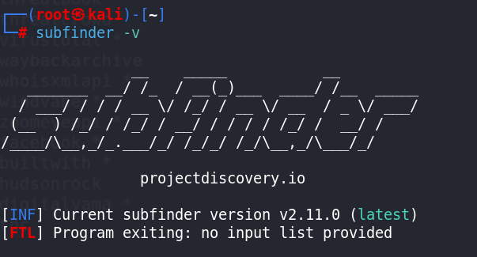

# 🌐 Subdomain Enumeration Tools(Passive)

Tools used to discover **subdomains** of a target domain, expanding the attack surface during reconnaissance 🔍:

1. 🧩 **Sublist3r**
2. 🚀 **Amass**
3. 🧭 **Assetfinder**
4. 🔎 **Findomain**
5. 🧬 **Altdns**
6. 💥 **Gobuster**

---

# 🔍 Subfinder



**Subfinder** is a **subdomain discovery tool** that finds valid subdomains for websites.  
It is designed as a **passive framework**, making it ideal for 🐞 bug bounties and safe for penetration testing 🔐.


## ⚙️ Installation

### 📥 Clone the repository & install using Go
```bash
GO111MODULE=on go get -v github.com/projectdiscovery/subfinder/v2/cmd/subfinder
````

---

### ⬆️ Install the latest version

```bash
go install -v github.com/projectdiscovery/subfinder/v2/cmd/subfinder@latest
```

---

### 📂 Move the binary to `/usr/local/bin`

```bash
cp -v /root/go/bin/subfinder /usr/local/bin/
```

---

### ✅ Verify the installation (In Kali linux Already installed)

```bash
subfinder -v
```

---
### Update Subfinder (latest)
- First login **`root`**
```bash
subfinder -up
```
---

### 📋 List all available sources

```bash
subfinder -ls
```

---

## 🔗 For Reference Details

* 🔗  [**Subfinder GitHub Repository**](https://github.com/projectdiscovery/subfinder.git)
* 🔗  [**Recon Guide**](https://dhiyaneshgeek.github.io/bug/bounty/2020/02/06/recon-with-me/)
* 🔗 [**Post Installation Instructions**](https://docs.projectdiscovery.io/opensource/subfinder/install#post-install-configuration)

---

### 🚀 Why use Subfinder?

* 🔍 Passive & stealthy enumeration
* ⚡ Fast and reliable
* 🧩 Integrates well with recon pipelines
* 🐛 Widely used in bug bounty hunting

---

## ⚙️ Configuration

To set up **`API keys`**, create a provider configuration file 🗝️:

```bash
vim $HOME/.config/subfinder/provider-config.yaml
```

- Using API key website below:

  🔗 [virustotal Links](https://www.virustotal.com/gui/user/gactiva/apikey)

  🔗 [projectDiscovery Links](https://cloud.projectdiscovery.io/scans?ref=api_key)

### 📄 Example `provider-config.yaml`

```yaml
binaryedge:
  - YOUR_BINARYEDGE_API_KEY_1
  - YOUR_BINARYEDGE_API_KEY_2

censys:
  - YOUR_CENSYS_API_ID:YOUR_CENSYS_API_SECRET

certspotter: []

passivetotal:
  - sample_email@user.com:sample_password

securitytrails: []

shodan:
  - YOUR_SHODAN_API_KEY

github:
  - YOUR_GITHUB_TOKEN_1
  - YOUR_GITHUB_TOKEN_2

zoomeye:
  - zoomeye_username:zoomeye_password
```

> 🔐 **Tip:** Never commit real API keys to GitHub.

> Use environment variables or private config files for safety.

---


## ▶️ Usage Examples

### 🔰 Basic Usage

- 🔍 **Run a simple scan for subdomains:**
```bash
subfinder -d instagram.com
````

* 📢 **Verbose output (see more details):**

```bash
subfinder -d instagram.com -v
```

* 💾 **Save output to a file:**

```bash
subfinder -d instagram.com -o insta_domain.txt
```

* 🔢 **Count the number of discovered subdomains:**

```bash
cat insta_domain.txt | wc -l
```

---

## 🎯 Using Specific Sources

* 🔐 **Search using `crt.sh`:**

```bash
subfinder -d instagram.com -s crtsh
```

* 🧠 **Search using multiple sources (`crt.sh` + GitHub):**

```bash
subfinder -d instagram.com -s crtsh,github,chaos
```

---

## 🚀 Comprehensive Scan

* 🌐 **Perform a full scan using all available sources:**

```bash
subfinder -d instagram.com -all
```

- 🚫 **Perform a full scan without wildcard filtering:**
```bash
subfinder -d instagram.com -all -nW
````

- Before we use we should configure 🔗[**massdns**](009-Configure-massdns.md)

* 🌐 **Use a custom resolver list:**

```bash
subfinder -d instagram.com -all -rL /opt/massdns/lists/resolvers.txt 
```

* 🤫 **Silent mode with resolver list and output file:save**

```bash
subfinder -d instagram.com -all -nW -silent -rL /opt/massdns/lists/resolvers.txt -o insta_domain2.txt
```

---

## 🌍 Scanning Multiple Domains

### 📝 Create a file with multiple domains:

```bash
vim target_domain.txt
```

### 📄 Example `target_domain.txt`:

```text
instagram.com
instagram.co.in
instagram.us
```

---


