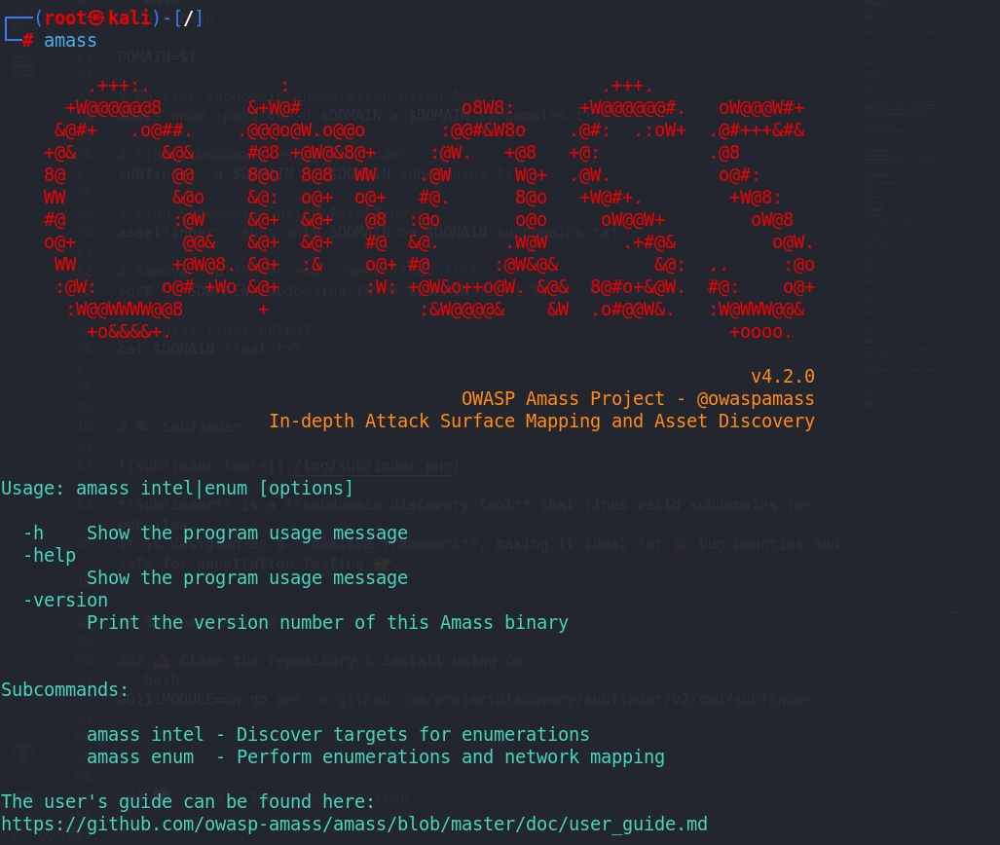

# 🧭 Amass

🔗 [**Amass GitHub Repository**](https://github.com/owasp-amass/amass)

**Amass** is a powerful tool for **network mapping** and **subdomain enumeration**.  
It is widely used to discover information about a target and map its **attack surface** for security assessments 🔐.

### 🔎 Core Capabilities
- 🧠 **intel** – Find information about the target and discover assets for enumeration  
- 🗺️ **enum** – Map the attack surface through enumeration and network mapping  
- 📊 **viz** – Visualize enumeration results  
- 🕰️ **track** – Track differences between enumerations over time  
- 🗄️ **db** – Manipulate the Amass graph database  

---

## ⚙️ Installation

### 📥 Install Amass on your system
```bash
apt install amass
````

---

## ▶️ Basic Commands

* ✅ **Run Amass to verify installation:**

```bash
amass
```

* ❓ **Display help information:**

```bash
amass --help
```

---

## 🧩 Configuration Files

Amass uses configuration files for advanced control and data sources 🛠️:

* 📄 **Example [`config.yaml`](https://github.com/owasp-amass/amass/blob/master/examples/config.yaml)**
* 🌐 **Example [`datasources.yaml`](https://github.com/owasp-amass/amass/blob/master/examples/datasources.yaml)**

These files allow you to:

* 🔑 Add API keys
* 📈 Improve enumeration coverage
* ⚡ Fine-tune performance and limits

---

### 🚀 Why use Amass?

* 🔍 Deep asset discovery
* 🌍 Active + passive enumeration
* 🧠 Graph-based intelligence
* 🐞 Ideal for **bug bounty** & **enterprise recon**

---

## 🧠 Intel Subcommand

Use the **`intel`** subcommand to gather **intelligence information** about a target 🎯.

- ❓ **Display help for the intel subcommand:**
```bash
amass intel --help
```

---

## 📌 Example Commands for Intel

* 📋 **List all available data sources:**

```bash
amass intel -list
```

* ⚙️ **List sources using a specific configuration file:**

```bash
amass intel -list -config /opt/amass-config.ini
```

```bash
amass intel -list -config config.yaml
```

---

* 🌐 **Perform intelligence gathering on a domain (example: instagram.com):**

```bash
amass intel -d instagram.com -whois
```

---

* 🏢 **Gather information for a specific organization:**

```bash
amass intel -org instagram
```

---

* 🧾 **Gather information based on an ASN (example: 394161):**

```bash
amass intel -asn 394161
```

---

* 🛰️ **Perform ASN lookup using Nmap:**

```bash
nmap --script targets-asn --script-args targets-asn.asn=394161
```

---

- 🌐 **Perform IP-based intelligence gathering with CIDR blocks:**
```bash
amass intel -ip -cidr 8.21.14.0/24
````

```bash
amass intel -ip -cidr 213.244.145.0/24
```

```bash
amass intel -ip -cidr 212.118.128.0/22,212.118.144.0/23,212.118.156.0/23,212.118.158.0/24,62.149.120.0/22,62.149.124.0/24,62.149.126.0/24,62.149.127.0/24,94.97.1.0/24,84.235.76.0/24
```

---

## 🔍 Enum Subcommand

The **`enum`** subcommand is used for **subdomain enumeration** 🕵️‍♂️.

* ❓ **Display help for the enum subcommand:**

```bash
amass enum --help
```

---

## 📌 Example Commands for Enum

* 📋 **List available sources for enumeration:**

```bash
amass enum -list
```

* ⚙️ **List sources using a specific configuration file:**

```bash
amass enum -list -config /opt/amass-config.ini
```

---

* 🕊️ **Perform passive enumeration for a domain (example: tesla.com):**

```bash
amass enum -passive -d tesla.com
```

---

* 📢 **Perform passive enumeration with verbose output (show source details):**

```bash
amass enum -passive -d tesla.com -v
```

---

* 🛠️ **Use a custom configuration file for passive enumeration:**

```bash
amass enum -passive -d tesla.com -config config.yaml
```
---

## ⚔️ Active Enumeration (Brute Force)

Active enumeration performs **brute-force subdomain discovery** using wordlists 🔎.  
⚠️ This is **noisy** and should be used **only with permission**.

---

### 📘 Perform active enumeration with brute-force subdomain discovery (using a wordlist)

```bash
amass enum -active -brute -w /usr/share/seclists/Discovery/DNS/subdomains-top1million-5000.txt -d tesla.com -o tesla.com
```

---

### 📗 Perform active enumeration with a different wordlist and additional options

```bash
amass enum -active -d tesla.com -brute -w /usr/share/seclists/Discovery/DNS/dns-Jhaddix.txt -src -ip -dir amass4tesla -o amass_results.txt
```

---

### 📙 Perform active enumeration with resolver list and save output

```bash
amass enum -active -d tesla.com -brute -w /usr/share/seclists/Discovery/DNS/dns-Jhaddix.txt -rf /opt/massdns/lists/resolvers.txt -src -ip -dir amass4tesla -o amass_results.txt
```

---

## 🧠 Explanation of Key Flags

* ⚔️ **`-active`** → Enables active enumeration
* 🔨 **`-brute`** → Brute-force subdomain guessing
* 📄 **`-w`** → Wordlist path
* 🌐 **`-d`** → Target domain
* 📡 **`-src`** → Show source of discovery
* 🧭 **`-ip`** → Include IP addresses
* 📂 **`-dir`** → Store Amass database/output
* 🧾 **`-o`** → Output file
* 🛡️ **`-rf`** → Custom DNS resolvers list

---

## ⚠️ Important Notes

* 🚨 Active scans generate **network traffic**
* 🔐 Always ensure **legal authorization**
* 🐞 Best used after **passive enumeration**
* ⚡ Combine with **Subfinder + HTTPx** for validation

---


