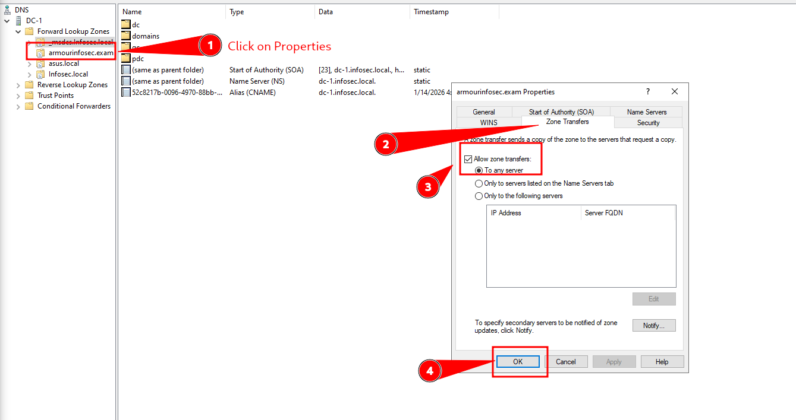

# 🌐 DNS Zone Transfer (AXFR)

A **DNS Zone Transfer** is a mechanism used to replicate DNS zone files (databases of records) between DNS servers—typically from a **primary/master** server to **secondary/slave** servers.

In **offensive security**, if a DNS server is **misconfigured**, it may allow **unauthenticated zone transfers**, which can expose:

- 🌍 All subdomains (**A records**)
- 📧 Mail servers (**MX records**)
- 🧭 Name servers (**NS records**)
- 📝 Text records (**SPF, DKIM, etc.**)
- 🧪 Internal domains *(e.g., dev, staging)*
- 🖥️ IP addresses of infrastructure

---

## 🔍 Types of Lookups

### ➡️ Forward Lookup

```bash
dig example.com
```

Resolves **domain names → IP addresses**.

---

### ⬅️ Reverse Lookup

```bash
dig -x 192.0.2.1
```

Resolves **IP addresses → hostnames**.

---

## 🔄 AXFR vs IXFR

| Type | Description |
|------|-------------|
| **AXFR** | Full zone transfer |
| **IXFR** | Incremental zone transfer (only changed records) |

---

## 🧭 Step 1: Find Name Servers (Authoritative DNS)

### 🔎 Using `nslookup`
```bash
nslookup -type=ns armour.local 192.168.1.45
```

### 🔎 Using `dig`

```bash
dig armour.local ns @192.168.1.45
```

```bash
dig zonetransfer.me ns
```

---

### 🧾 Check SOA Record (Start of Authority)

```bash
dig zonetransfer.me SOA
```

---

### 🌐 Discover DNS Services in Local Network

```bash
nmap -v -sT -sU -p T:53,U:53 192.168.1.1/24
```

---

### ⚙️ Check Resolver DNS Configuration

```bash
cat /etc/resolv.conf
```
---

## 🔎 Step 2: Find DNS for Host / IP

### 🧪 Using `nslookup`
```bash
nslookup dc01.armour.local 192.168.1.51
```

### 🧪 Using `dig`

```bash
dig dc01.armour.local @192.168.1.51
```

---

### 🌍 Public Name Servers

```bash
dig nsztm1.digi.ninja
```

```bash
dig nsztm2.digi.ninja
```

---

## 🚨 Step 3: Attempt DNS Zone Transfer

### 🔧 Using `host`

```bash
host -t axfr zonetransfer.me 81.4.108.41
```

```bash
host -t axfr ai.local 192.168.1.71
```

---

### ➡️ Forward Zone

```bash
host -t axfr armour.local 192.168.1.51
```

---

### ⬅️ Reverse Zone

```bash
host -t axfr 1.168.192.in-addr.arpa 192.168.1.51
```

---

## 🔎 Using `nslookup`

```bash
nslookup -type=axfr armour.local 192.168.1.51
```

```bash
nslookup -type=axfr zonetransfer.me 81.4.108.41
```

---

## 🧪 Using `dig`

```bash
dig zonetransfer.me -t axfr @81.4.108.41
```

```bash
dig zonetransfer.me axfr @81.4.108.41
```

```bash
dig -t axfr zonetransfer.me @81.4.108.41
```

```bash
dig armour.local axfr @192.168.1.51
```

```bash
dig -t axfr armour.local @192.168.1.51
```

```bash
dig -t axfr zonetransfer.me @nsztm1.digi.ninja
```

```bash
dig zonetransfer.me axfr @nsztm1.digi.ninja
```

---

## 🛰️ Using `nmap`

```bash
nmap -v -sT -sU -p 53 --script=dns-zone-transfer.nse --script-args dns-zone-transfer.domain=zonetransfer.me nsztm1.digi.ninja
```

---

## 🔑 Key Note

If a DNS server is **misconfigured** and allows **AXFR**,
you may retrieve the **entire DNS zone**, including:

* Subdomains
* Mail servers
* Internal hosts
* IP infrastructure



This makes DNS Zone Transfer a **high-impact reconnaissance technique**.

---

## 🔁 DNS Zone Transfer Script

```bash
for ns in $(dig ns example.com +short); do
  dig axfr example.com @$ns
done
```

---

## 📄 Example Output

```text
zonetransfer.me.     86400   IN  SOA nsztm1.digi.ninja. robin.digi.ninja. (
                        2020041201 ; serial
                        3600       ; refresh
                        600        ; retry
                        604800     ; expire
                        3600 )     ; minimum

zonetransfer.me.     86400   IN  A     81.4.108.41
www.zonetransfer.me. 86400   IN  CNAME zonetransfer.me.
```

---

## 🛡️ Defensive Notes

* Most modern DNS servers **restrict AXFR** to trusted IPs only
* Still useful to test during:

  * 🧪 Internal assessments
  * 🔴 Red team engagements
  * ⚠️ Misconfigured staging / test environments
* 🔄 Reverse zone transfers (`in-addr.arpa`) can leak **internal PTR records**

---

## 📌 Summary

* AXFR is a **powerful reconnaissance technique** if exploitable
* 🤖 Automate checks early in the recon phase
* 🌐 Most live domains block AXFR, but **internal DNS often doesn’t**

---


